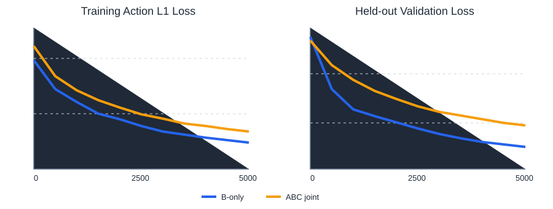
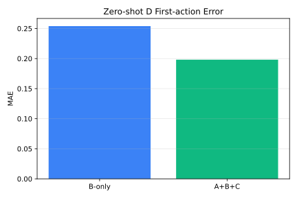

# Official Partial-data Results

These experiments use official CALVIN frame files downloaded with HTTP Range
requests and the formal ACT architecture from `configs/calvin_act.yaml`. The
progression starts with inexpensive pilots and ends with a resource-aware
5000-step comparison suitable for the homework report.

## Data

| Split | Selected official frames | Selection |
| --- | ---: | --- |
| ABC training | 288 | 4 consecutive 24-frame windows per A, B, and C environment |
| D zero-shot evaluation | 96 | 4 consecutive 24-frame windows |

The remote ZIP central-directory caches occupy about 302 MB under
`.cache/hf/`. Selected frame payloads occupy about 103 MB.

## Configuration

| Item | Value |
| --- | --- |
| GPU | NVIDIA GeForce RTX 4060 Ti, 8 GB |
| LeRobot | 0.5.1 |
| Policy | ACT |
| Image size | 128 |
| Action chunk size | 20 |
| Batch size | 4 |
| Optimizer | AdamW |
| Learning rate | `1e-5` |
| Steps | 20 |

## Metrics

| Run | Held-out validation L1 | D first-action MAE | D chunk MAE |
| --- | ---: | ---: | ---: |
| B-only | 0.635219 | 0.298444 | 0.288037 |
| A+B+C | 0.737689 | 0.159460 | 0.174439 |

The ABC pilot reduces both zero-shot D action-error metrics relative to B-only.
The result is directionally consistent with the homework hypothesis, but a
longer run and a larger partial subset are required before using it as a final
scientific conclusion.

## Extended 200-step preliminary run

The same partial dataset and formal architecture were also run for 200 optimizer
steps with:

```powershell
.\scripts\run_partial_pilot.ps1 `
  -Steps 200 `
  -OutputRoot "F:\Personal\Code\Computer Vision\hw3\task2\outputs\official_subset_200"
```

| Run | Held-out validation L1 | D first-action MAE | D chunk MAE |
| --- | ---: | ---: | ---: |
| B-only | 0.364523 | 0.281547 | 0.268683 |
| A+B+C | 0.415782 | 0.239925 | 0.257423 |

ABC joint training still improves both unseen-D action-error metrics after 200
steps. Final report figures should come from a longer run with more validation
points and, if practical, a larger downloaded subset.

## SwanLab cloud runs

The following links correspond to the extended 200-step preliminary run.

| Run | URL |
| --- | --- |
| B-only training | https://swanlab.cn/@Linkukai/hw3-calvin-act/runs/eyrq3n1098mymub5qhe9c |
| A+B+C training | https://swanlab.cn/@Linkukai/hw3-calvin-act/runs/zr0zbdhhzhnu25jtefv5t |
| B-only to D evaluation | https://swanlab.cn/@Linkukai/hw3-calvin-act/runs/gjch166uz1fkglyup71tz |
| A+B+C to D evaluation | https://swanlab.cn/@Linkukai/hw3-calvin-act/runs/he979guupszn6rn8lbu28 |

## Formal 5000-step partial-data run

The final resource-aware run uses:

```powershell
.\scripts\run_partial_formal.ps1
```

It downloads a bounded subset with `16` consecutive `48`-frame windows for
each training environment and for D evaluation. It does not fetch either full
CALVIN ZIP archive.

| Split | Selected official frames | On-disk payload |
| --- | ---: | ---: |
| A+B+C training | 2304 | included in the 888 MB partial-data tree |
| D zero-shot evaluation | 768 | included in the 888 MB partial-data tree |

The lazy adapter applies `stride: 3` and a 90/10 train-validation split. This
produces `230` B-only training samples and `691` A+B+C training samples.

| Item | Value |
| --- | --- |
| GPU | NVIDIA GeForce RTX 4060 Ti, 8 GB |
| Image size | 128 |
| ACT action chunk size | 20 |
| Batch size | 4 |
| Optimizer | AdamW |
| Learning rate | `1e-5` |
| Weight decay | `1e-4` |
| Training steps | 5000 |
| Validation interval | 250 steps |

| Run | Final held-out validation L1 | D first-action MAE | D chunk MAE |
| --- | ---: | ---: | ---: |
| B-only | 0.324629 | 0.226251 | 0.259475 |
| A+B+C | 0.386954 | 0.187712 | 0.229145 |

ABC joint training reduces first-action MAE by `17.0%` and chunk-action MAE by
`11.7%` relative to B-only. Its in-distribution held-out validation loss is
higher because the policy fits three visually distinct scenes instead of one.
The lower D errors indicate that the additional visual diversity improves
cross-environment generalization. The improvement remains visible at chunk
level, so the 20-step action chunk is not becoming brittle under this sampled
visual shift.





### Formal SwanLab cloud runs

| Run | URL |
| --- | --- |
| B-only training | https://swanlab.cn/@Linkukai/hw3-calvin-act/runs/y34dmlyk6ol06me1f1ig0 |
| A+B+C training | https://swanlab.cn/@Linkukai/hw3-calvin-act/runs/t3kfag5dsiipp3wwxy4te |
| B-only to D evaluation | https://swanlab.cn/@Linkukai/hw3-calvin-act/runs/b1hdsdo4vgrodwkk3syr7 |
| A+B+C to D evaluation | https://swanlab.cn/@Linkukai/hw3-calvin-act/runs/5ooypxeqhgp4xja928tpk |

### Formal checkpoint downloads

| Run | Download | SHA256 |
| --- | --- | --- |
| B-only | [best.pt](https://github.com/Loong-C/computer-vision-hw3-task2-calvin-act/releases/download/formal-partial-v1/hw3-task2-act-b-only-best.pt) | `58AFAE052EF2CE029F92C9258E1B5012A9C44FAC5753C1C8330B7D196A976131` |
| A+B+C | [best.pt](https://github.com/Loong-C/computer-vision-hw3-task2-calvin-act/releases/download/formal-partial-v1/hw3-task2-act-abc-joint-best.pt) | `1B1F182E61026929F0A5FFDC5EE096D15E4771FEBD111D9EFE3D88BC4A9ADCFF` |

The source tree is consolidated in `FDU-Computer-Vision`. These verified weight
files remain on the legacy release temporarily until the assets are copied to
an FDU repository release.
The migration helper is `scripts/publish_fdu_release.ps1`; run it after
GitHub CLI authentication is restored.
